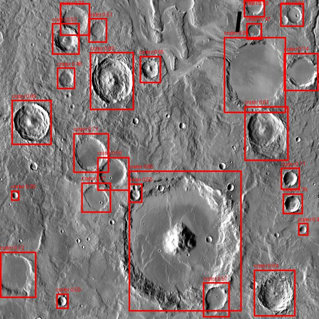
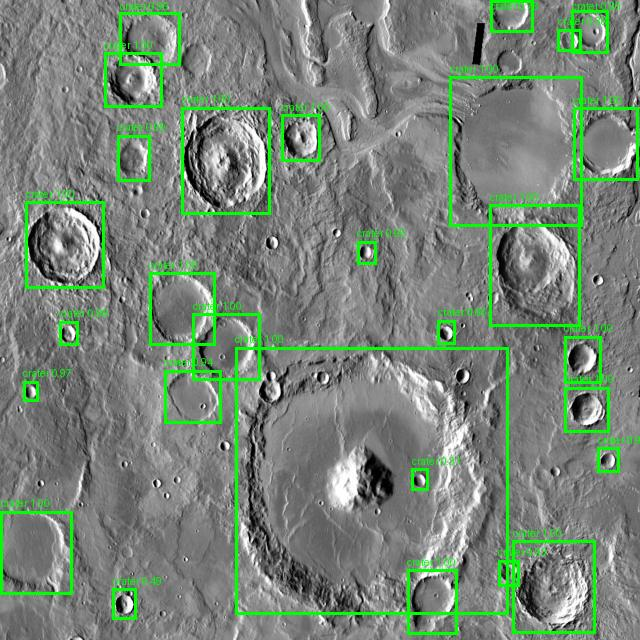
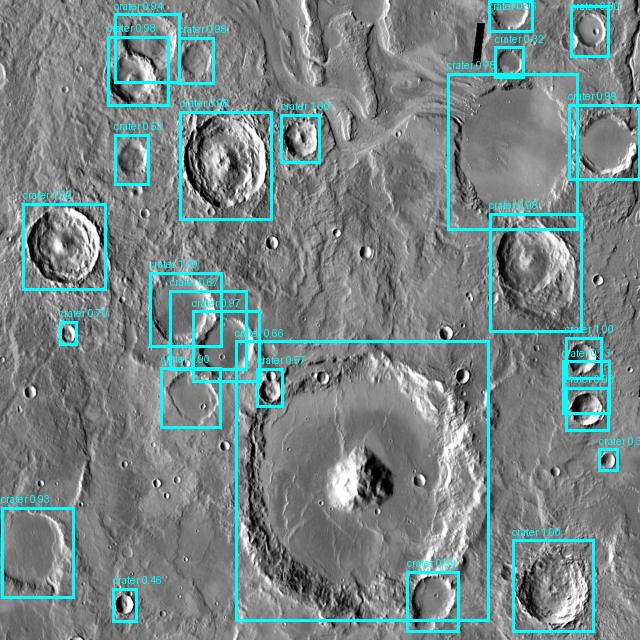
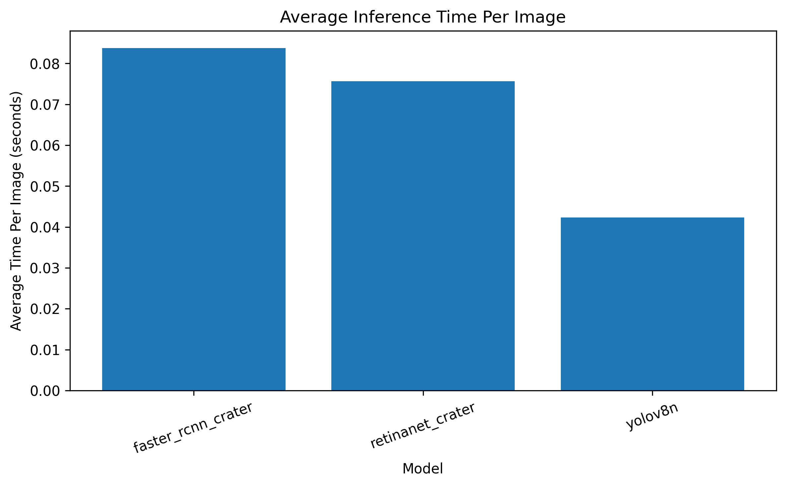

# ECE 533 Final Project

# Deep Learning-Based Lunar Crater Detection Using Modern Object Detection Architectures

## Scott Nguyen

University of New Mexico
ECE 533
Spring 2026

---

# Abstract

This project investigates the use of modern deep learning object detection architectures for automated lunar crater detection using annotated planetary surface imagery. Automated crater detection is an important problem within planetary science, aerospace imaging, autonomous navigation, and terrain analysis. Manual crater annotation is time-consuming and difficult to scale across large planetary datasets, motivating the need for robust computer vision-based detection systems.

Three deep learning object detection architectures were implemented and evaluated:

* YOLOv8 Nano
* Faster R-CNN
* RetinaNet

The project workflow included:

* dataset preparation
* dataset inspection
* ground truth visualization
* model training
* prediction visualization
* quantitative accuracy evaluation
* computational performance analysis

All experiments were implemented in Google Colab using GPU acceleration. Comparative evaluation demonstrated that YOLOv8 achieved the strongest balance between crater detection accuracy, inference speed, and computational efficiency.

---

# Motivation

Planetary crater detection is an important task within:

* planetary mapping
* surface analysis
* terrain hazard assessment
* autonomous aerospace navigation
* scientific geological analysis

Traditional crater identification methods often rely on manual inspection or classical image processing techniques, both of which become increasingly difficult when applied to large-scale planetary datasets.

Recent advances in deep learning and computer vision have enabled object detection architectures to achieve strong performance across a wide variety of image recognition tasks. This project explores whether these same architectures can effectively generalize to crater detection using lunar and Martian surface imagery.

A key motivation of this work is understanding the tradeoffs between:

* detection accuracy
* computational efficiency
* inference speed
* model complexity

for potential use in aerospace and planetary exploration systems.

---

# Dataset

Dataset source:
https://www.kaggle.com/datasets/lincolnzh/martianlunar-crater-detection-dataset

The dataset contains annotated lunar and Martian surface imagery formatted for YOLO-based object detection workflows.

The dataset includes:

* training images
* validation images
* testing images
* crater bounding box annotations

The dataset was organized into standard supervised learning splits and used consistently across all evaluated detection architectures to ensure fair experimental comparison.

---

# Dataset Summary and Inspection

Prior to model training, the dataset was inspected to verify:

* dataset split integrity
* image counts
* annotation counts
* crater bounding box formatting
* compatibility with object detection pipelines

Ground truth crater annotations were visualized to confirm correct bounding box alignment across the dataset.

## Image Distribution by Dataset Split


## Crater Annotation Distribution


---

# Ground Truth Bounding Box Visualization

Ground truth crater annotations were visualized prior to training to validate annotation quality and dataset consistency.

These examples demonstrate the labeled crater structures used during supervised object detection training.

## Ground Truth Example 1


## Ground Truth Example 2


## Ground Truth Example 3


---

# Methodology

Three object detection architectures were implemented and evaluated:

* YOLOv8 Nano
* Faster R-CNN
* RetinaNet

Each model was trained using:

* identical dataset splits
* GPU acceleration
* comparable training configurations
* identical crater annotations

The experimental workflow included:

1. dataset preparation
2. dataset inspection
3. annotation verification
4. model training
5. prediction generation
6. prediction visualization
7. quantitative evaluation
8. computational timing analysis

The models were trained and evaluated using Google Colab with NVIDIA Tesla T4 GPU acceleration.

The project additionally logged:

* training duration
* inference timing
* model comparison metrics
* detection statistics
* prediction visualizations

throughout the experimental pipeline.

---

# YOLOv8

YOLOv8 is a lightweight single-stage object detector optimized for fast inference and real-time detection tasks. The architecture predicts bounding boxes and object classifications directly from the input image in a single forward pass.

Advantages:

* fast training
* fast inference
* efficient GPU utilization
* lightweight architecture

YOLOv8 Nano was selected due to its balance between computational efficiency and detection capability.

---

# Faster R-CNN

Faster R-CNN is a two-stage object detection architecture that first generates region proposals before performing classification and localization.

Advantages:

* strong localization quality
* high detection precision

Limitations:

* slower inference
* higher computational overhead
* increased training complexity

Faster R-CNN served as a high-capacity comparison baseline for crater localization performance.

---

# RetinaNet

RetinaNet is a single-stage detector that introduces focal loss to improve learning under class imbalance conditions.

Advantages:

* stable training
* improved handling of sparse object distributions
* intermediate computational complexity

RetinaNet provided an additional comparison point between lightweight YOLO-based detectors and heavier region-based architectures.

---

# Results

The trained crater detection models were evaluated using:

* prediction visualization
* mAP-based accuracy metrics
* training duration
* inference speed
* computational efficiency

YOLOv8 demonstrated the strongest balance between:

* crater localization quality
* computational efficiency
* training speed
* inference speed

Faster R-CNN produced high-quality localization results but required significantly greater computational overhead.

RetinaNet demonstrated intermediate performance between YOLOv8 and Faster R-CNN.

---

# Prediction Bounding Box Comparison

The following examples compare crater predictions generated by each trained detection architecture.

## Ground Truth


---

## YOLOv8 Prediction



---

## Faster R-CNN Prediction



---

## RetinaNet Prediction



---

# Quantitative Evaluation

The crater detection architectures were quantitatively evaluated using:

* mAP@0.50
* mAP@0.50:0.95
* recall
* training duration
* inference speed
* computational timing metrics

## Accuracy Comparison


## Training Time Comparison


## Inference Time Comparison


## Average Inference Time Per Image



---

# Discussion

The experimental results demonstrated that modern deep learning object detection architectures can successfully perform automated lunar crater detection using annotated planetary surface imagery.

YOLOv8 provided the strongest overall balance between:

* detection accuracy
* computational efficiency
* training speed
* inference speed

The lightweight single-stage detector achieved rapid training and efficient inference while maintaining strong crater localization capability.

Faster R-CNN demonstrated strong localization quality but introduced significantly greater computational overhead due to the region proposal stage. Although the architecture can provide high-quality detections, the additional complexity reduces its suitability for real-time aerospace deployment scenarios.

RetinaNet demonstrated intermediate performance between YOLOv8 and Faster R-CNN. The focal loss mechanism improved stability under sparse crater distributions while maintaining moderate computational requirements.

The project additionally demonstrated the effectiveness of deep learning detection frameworks for:

* planetary surface analysis
* aerospace imaging
* autonomous terrain understanding
* crater localization tasks

---

# Conclusion

This project successfully developed and evaluated multiple deep learning object detection pipelines for automated lunar crater detection.

The full workflow included:

* dataset preparation
* dataset verification
* ground truth visualization
* model training
* prediction visualization
* quantitative evaluation
* computational performance analysis

Among the evaluated architectures, YOLOv8 demonstrated the best overall balance between crater detection accuracy, computational efficiency, and inference speed.

The results demonstrate that modern deep learning object detection architectures provide an effective and scalable solution for automated planetary crater analysis and future aerospace vision applications.

Future work could further improve detection performance through:

* larger crater datasets
* higher-resolution imagery
* advanced augmentation techniques
* larger object detection architectures
* segmentation-based crater detection
* deployment onto embedded aerospace hardware platforms

---

# Google Colab Implementation

This GitHub repository provides a high-level summary of the project results and experimental findings.

The complete Google Colab implementation includes:

* full training pipelines
* environment setup instructions
* dataset download scripts
* evaluation scripts
* visualization generation
* computational timing analysis
* model comparison workflows
* saved outputs and logs

Google Drive Folder:
[https://drive.google.com/drive/folders/1JRRDJJfL8GadZKqLlOrN9a9axBuA9XKA?usp=sharing](https://drive.google.com/drive/folders/18OnwDg1re-HRRi3NxY0z8zSU-ZSPvP3b)

---

# Repository Structure

```text id="aqm5l7"
ECE-533-Final-Project/
├── images/
│   ├── ground_truth_examples/
│   ├── prediction_examples/
│   ├── accuracy_metrics_comparison.png
│   ├── avg_inference_time_per_image.png
│   ├── dataset_annotation_distribution.png
│   ├── dataset_image_distribution.png
│   ├── inference_time_comparison.png
│   ├── prediction_bounding_box_examples.png
│   └── training_time_comparison.png
├── logs/
│   ├── accuracy_evaluation_results.csv
│   ├── dataset_summary.csv
│   ├── faster_rcnn_crater_training_log.csv
│   ├── ground_truth_visualization_summary.csv
│   ├── inference_comparison_log.csv
│   ├── model_comparison_summary.csv
│   ├── retinanet_crater_training_log.csv
│   └── yolo_training_log.csv
└── report.md
```

---

# References

1. Ultralytics YOLOv8
   https://github.com/ultralytics/ultralytics

2. TorchVision Object Detection Models
   https://pytorch.org/vision/stable/models.html

3. Lunar and Martian Crater Dataset
   https://www.kaggle.com/datasets/lincolnzh/martianlunar-crater-detection-dataset

4. PyTorch Documentation
   https://pytorch.org/
