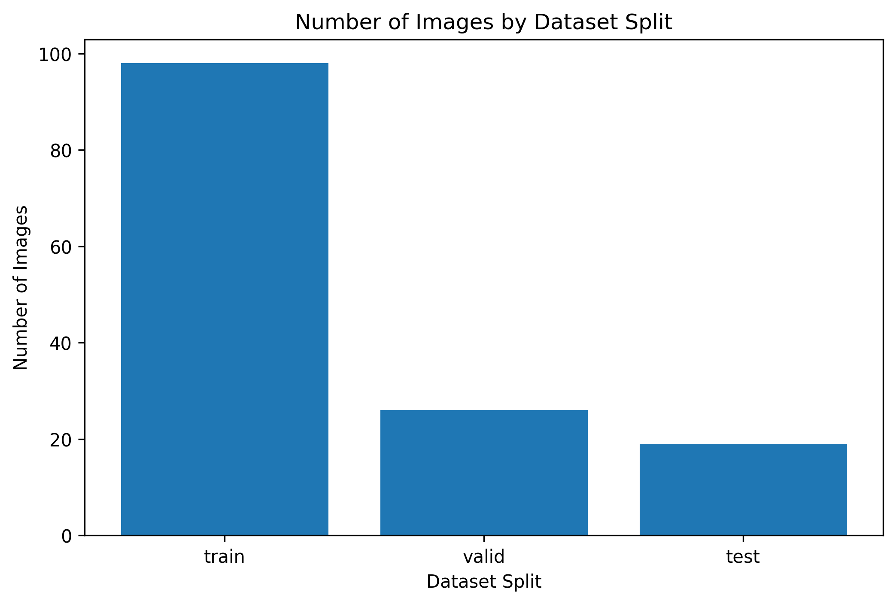
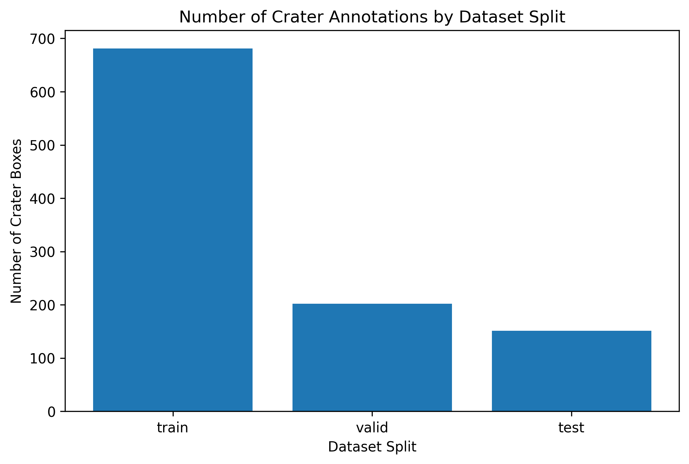
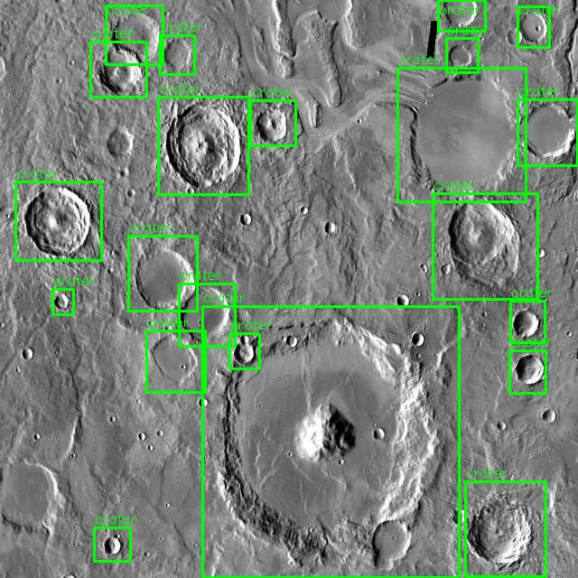
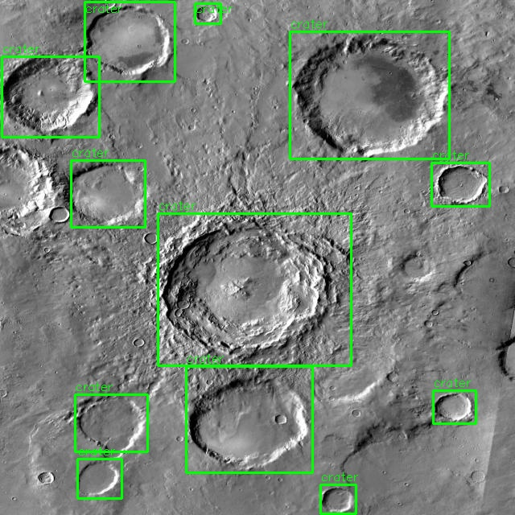
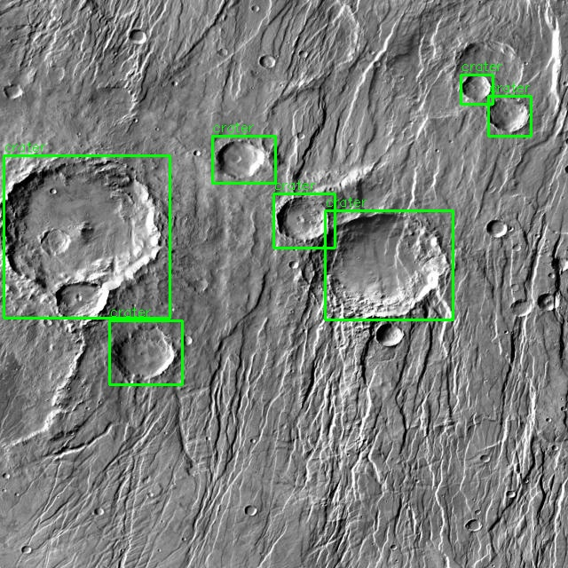
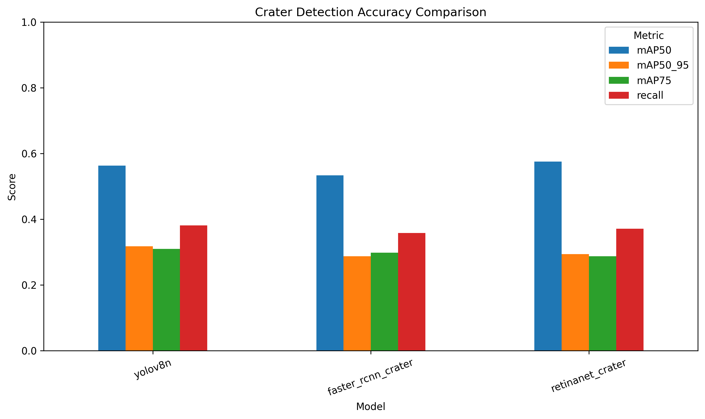
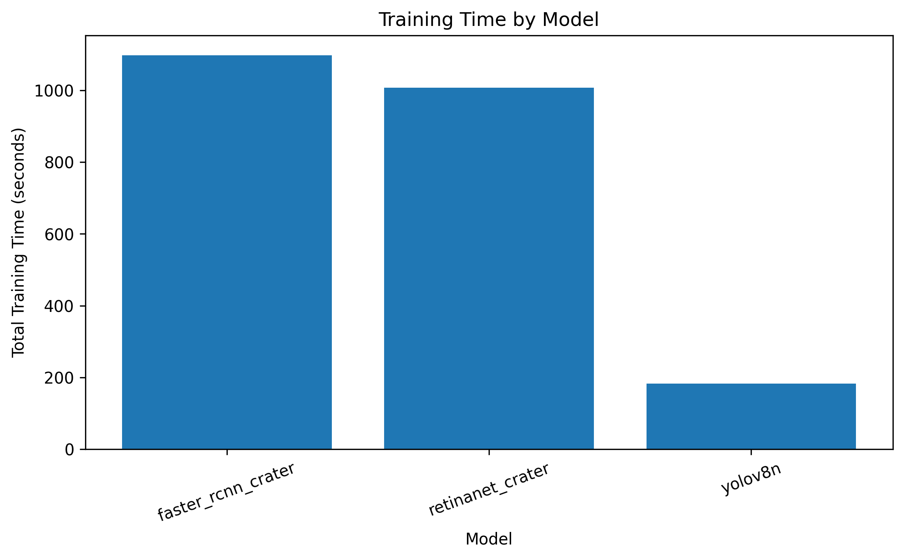
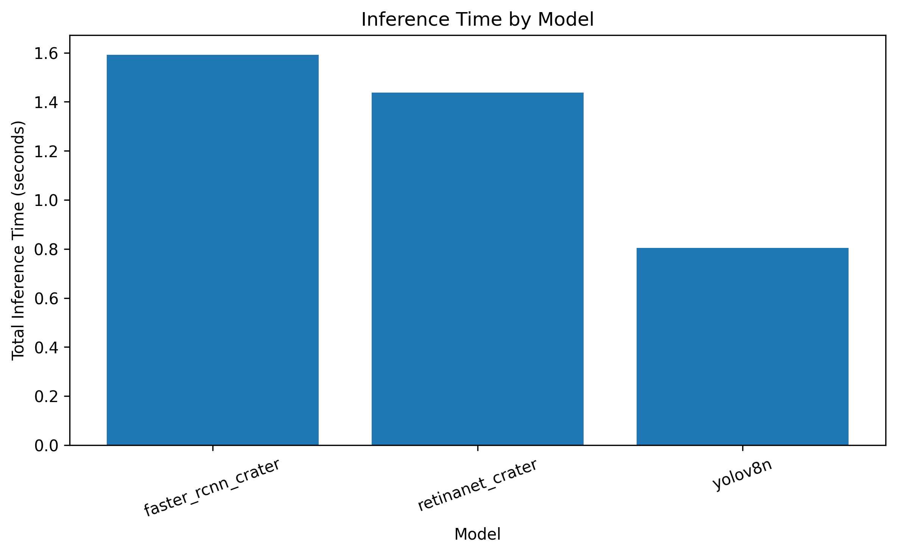

# ECE 533 Final Project

# Deep Learning-Based Lunar Crater Detection Using Object Detection Architectures

## Scott Nguyen

University of New Mexico
ECE 533
Spring 2026

---

# Overview

This project investigates the use of modern deep learning object detection architectures for automated lunar crater detection using annotated planetary surface imagery.

The following object detection models were implemented and evaluated:

* YOLOv8 Nano
* Faster R-CNN
* RetinaNet

The project workflow includes:

* dataset preparation
* dataset verification
* ground truth visualization
* model training
* prediction visualization
* quantitative accuracy evaluation
* computational performance analysis

All experiments were implemented in Google Colab using GPU acceleration.

---

# Dataset

Dataset source:
https://www.kaggle.com/datasets/lincolnzh/martianlunar-crater-detection-dataset

The dataset contains annotated lunar and Martian surface imagery formatted for YOLO-based object detection workflows.

The dataset includes:

* training images
* validation images
* testing images
* crater bounding box annotations

---

# Dataset Summary and Inspection

The dataset was inspected prior to training to verify:

* image counts
* annotation counts
* dataset split integrity
* crater bounding box formatting

## Dataset Distribution Plots

### Image Distribution by Dataset Split



### Crater Annotation Distribution



---

# Ground Truth Bounding Box Visualization

Ground truth crater annotations were visualized to confirm proper bounding box alignment across the dataset before training.

## Ground Truth Examples

### Example 1



### Example 2



### Example 3



---

# Model Training Methodology

Three object detection architectures were trained and evaluated:

* YOLOv8 Nano
* Faster R-CNN
* RetinaNet

All models were trained using:

* identical dataset splits
* comparable training configurations
* GPU acceleration in Google Colab

The training workflow included:

* model checkpoint saving
* computational timing analysis
* prediction visualization
* quantitative evaluation

---

# Results

The crater detection models were evaluated using:

* prediction visualization
* mAP-based accuracy metrics
* training duration
* inference speed
* computational efficiency

YOLOv8 demonstrated the strongest balance between:

* training speed
* inference speed
* crater localization quality
* computational efficiency

Faster R-CNN achieved strong localization performance but required significantly greater computational resources due to the region proposal pipeline.

RetinaNet demonstrated intermediate performance between YOLOv8 and Faster R-CNN.

---

# Prediction Bounding Box Comparison

The following examples compare ground truth crater annotations against the predictions generated by each trained detection architecture.

## YOLOv8 Predictions


## Faster R-CNN Predictions


## RetinaNet Predictions


---

# Quantitative Accuracy Evaluation

The trained models were evaluated using:

* mAP@0.50
* mAP@0.50:0.95
* recall
* inference timing
* computational performance metrics

## Accuracy Comparison Plot



## Training Time Comparison



## Inference Time Comparison



---

# Discussion

The experimental results demonstrated that modern deep learning object detection architectures can successfully perform automated lunar crater detection using annotated planetary surface imagery.

YOLOv8 provided the strongest balance between computational efficiency and detection capability. The lightweight single-stage detector achieved rapid training and fast inference while maintaining strong crater localization accuracy.

Faster R-CNN produced high-quality localization performance but introduced significantly greater computational overhead due to the region proposal pipeline.

RetinaNet demonstrated intermediate performance between YOLOv8 and Faster R-CNN.

The project additionally demonstrated the applicability of deep learning detection frameworks to aerospace imaging and planetary surface analysis applications.

---

# Conclusion

This project successfully developed and evaluated multiple deep learning object detection pipelines for automated lunar crater detection.

The full workflow included:

* dataset preparation
* dataset verification
* ground truth visualization
* model training
* prediction visualization
* quantitative evaluation
* computational performance analysis

Among the evaluated architectures, YOLOv8 demonstrated the best overall balance between crater detection accuracy, training speed, and inference efficiency.

The results demonstrate that modern deep learning object detection frameworks provide an effective and scalable solution for automated planetary crater analysis and future aerospace vision applications.

Future work could further improve performance through:

* larger crater datasets
* higher-resolution imagery
* advanced augmentation methods
* larger detection architectures
* segmentation-based crater detection
* embedded aerospace deployment optimization

---

# Repository Structure

```text
ece-533-final-project/
├── README.md
├── images/
├── logs/
├── notebooks/
└── weights/
```

---

# Google Colab Notebook

Google Drive Folder:
https://drive.google.com/drive/folders/1JRRDJJfL8GadZKqLlOrN9a9axBuA9XKA?usp=sharing

---

# References

1. Ultralytics YOLOv8
   https://github.com/ultralytics/ultralytics

2. TorchVision Object Detection Models
   https://pytorch.org/vision/stable/models.html

3. Lunar and Martian Crater Dataset
   https://www.kaggle.com/datasets/lincolnzh/martianlunar-crater-detection-dataset

4. PyTorch Documentation
   https://pytorch.org/
